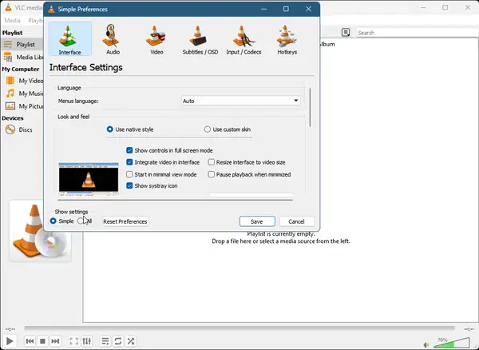

<p align="center">
  <picture>
    <source media="(prefers-color-scheme: dark)" srcset="assets/branding/icop-steel-scanner-animated.gif">
    <source media="(prefers-color-scheme: light)" srcset="assets/branding/icop-steel-scanner-animated-light.gif">
    
  </picture>
</p>

<h1 align="center">icop - AI Content Filter for VLC</h1>

<p align="center">
  An open-source, privacy-first VLC plugin for local AI sensitive-content detection and frame blocking with ONNX Runtime.
</p>

<p align="center">
  <a href="INSTALL.md"></a>
  <a href="https://github.com/asayed18/icop/actions/workflows/ci.yml"></a>
  <a href="https://github.com/asayed18/icop/actions/workflows/codeql.yml"></a>
  <a href="LICENSE"></a>
  <a href="https://github.com/sponsors/asayed18"></a>
</p>

> [!IMPORTANT]
> icop is a best-effort content filter. Detection models can produce
> false positives and false negatives, so test your configuration before
> relying on it for child-safety or accessibility needs.

## Overview

icop is an open-source AI content filtering plugin for VLC media player. It uses
local ONNX Runtime inference to classify buffered video frames before display,
then shows the original frame or applies a black, blur, or warning treatment.
Processing stays on your device; video frames are not uploaded to a service.

The plugin targets Windows and Linux today, with experimental macOS build and
installation support. It is designed for privacy-conscious playback, offline
video filtering, and developers exploring ONNX-based computer vision in VLC.

## Demo

<p align="center">
  <a href="demo.mp4">
    
  </a>
</p>

<p align="center">
  <strong><a href="demo.mp4">Watch the full ICOP VLC walkthrough</a></strong><br>
  Plugin setup, blocking styles, muted playback, and the detection debug overlay.
</p>

The public Git repository is source-only. Models, ONNX Runtime binaries, build
trees, portable VLC copies, and release archives are downloaded or generated
locally and are not committed.

## Platform Status

| Platform       | Status               | GPU inference                        |
| -------------- | -------------------- | --------------------------------------|
| Windows x86_64 | Tested               | CUDA (NVIDIA) / D3D12 (GPU fallback) |
| Linux x86_64   | Tested               | CUDA (NVIDIA) / MIGraphX (AMD)       |
| Linux ARM64    | Tested               | CPU only                              |
| macOS x86_64   | Tested               | CPU / CoreML                          |
| macOS ARM64    | Tested               | CPU / CoreML                          |

GPU runtimes are detected automatically at plugin load. Contributions that
improve GPU support or validate the macOS path are welcome.

## VLC AI Filter Features

- Buffers frames so playback does not intentionally outrun classification
- Renews an active block with one stride-aligned sample before its configured
  padding expires, avoiding raw-frame flashes during a continuous detection
- Uses the same delayed queue for CPU and supported hardware inputs; hardware
  queue depth is constrained by the decoder's available surfaces
- Runs inference locally with ONNX Runtime
- Supports multiple model profiles and automatic model-sized preprocessing
- Provides black, blur, and warning block styles
- Can mute audio while blocked output is shown
- Supports precomputed decision maps for scan-ahead playback
- Includes a D3D11 processing path for supported Windows hardware decoding
- On Linux opaque VAAPI/VDPAU-style inputs, analyzes via VLC image conversion and drops blocked frames fail-closed when in-place masking is not available
- Uses higher-resolution VAAPI blur staging and high-quality VPP scaling when
  the driver supports it, reducing visible block artifacts on masked frames
- Produces versioned, platform-specific packages with checksums and metadata
- Includes unit, integration, and benchmark targets

## Use Cases

- Local and offline sensitive-content filtering in VLC media player
- Best-effort parental controls and safer shared-screen playback
- Privacy-first video moderation without cloud uploads
- ONNX Runtime, CUDA, and D3D11 video-filter development
- Cross-platform computer-vision research and prototyping

## How It Works

1. VLC decodes a video frame.
2. icop holds the frame before presentation.
3. The detector converts and resizes a sample for the selected model.
4. ONNX Runtime classifies the sample and applies the configured block window.
5. The plugin releases the original or masked frame to VLC.

The central safety invariant is simple: a frame that requires analysis should
not be shown before its decision is available.

## Quick Install

Ask an AI assistant to install icop using the
[INSTALL.md](INSTALL.md) guide. Give it the file and it will handle
downloading, copying, enabling the filter, and applying best-practice settings
for your platform.

## Install and Build icop for VLC (Developers)

Requirements:

- CMake 3.16 or newer
- Ninja or another supported CMake generator
- A C compiler and a C++17 compiler
- VLC 3.0 development files for the target platform

Configure, build, and package:

```powershell
make build
make test
make release
```

On Windows, use `mingw32-make` instead of `make` when that is the installed GNU
Make command. Direct CMake commands remain available in
[CONTRIBUTING.md](CONTRIBUTING.md).

The package is written to `releases/v<version>/<os>/`. See
[INSTALL.md](INSTALL.md) for end-user installation steps.

### Windows CUDA package

To build a Windows package that uses the CUDA execution provider, configure a
matching GPU ONNX Runtime bundle and include its NVIDIA dependencies:

```powershell
cmake -S . -B build-ninja -G Ninja -DNSFW_GPU_RUNTIME=ON -DNSFW_INSTALL_CUDA_RUNTIME=ON -DNSFW_CUDA_VERSION=13
cmake --build build-ninja --target icop_package -j 8
```

At runtime, icop logs `ONNX session ready with cuda,cpu provider` when CUDA is
active and safely falls back to CPU if the CUDA provider cannot initialize.

When upgrading from VLC iClean, remove `libnsfw_filter_plugin` and
`nsfw_filter_core` files before regenerating the plugin cache. The runtime
files are named `libicop_plugin` and `icop_core`.

### Install into VLC

Build the host release, detect the installed VLC, copy the matching
x86/x64/ARM64 payload, and regenerate VLC's plugin cache:

```sh
make install_plugin
```

Use `mingw32-make install_plugin` on Windows when GNU Make is installed under
that name. The target selects the PowerShell installer on Windows and the POSIX
installer on Linux/macOS. Both validate release checksums, remove legacy VLC
iClean files, roll back failed copies, and regenerate the plugin cache. Windows
requests administrator access when needed; Linux and macOS use `sudo` only for
protected plugin directories.

Preview the operation or select a specific installation directly:

```powershell
powershell -ExecutionPolicy Bypass -File .\tools\install_icop_plugin.ps1 -WhatIf
powershell -ExecutionPolicy Bypass -File .\tools\install_icop_plugin.ps1 -VlcRoot "C:\Program Files\VideoLAN\VLC"
```

```sh
sh tools/install_icop_plugin.sh --dry-run
sh tools/install_icop_plugin.sh --vlc-root /usr
```

Close VLC before installation. To stop it explicitly, pass
`INSTALL_ARGS=-StopVlc` on Windows or `INSTALL_ARGS=--stop-vlc` on Linux/macOS.

See [CONTRIBUTING.md](CONTRIBUTING.md) for lightweight Windows, Linux, and WSL
build and test commands. See [docs/releasing.md](docs/releasing.md) for package
versioning, checksums, and release verification.

## ONNX Model Profiles

| Profile     |   Input | Upstream project                                                                          | Upstream license             |
| ----------- | ------: | ----------------------------------------------------------------------------------------- | ---------------------------- |
| `marqo`     | 384x384 | [Marqo NSFW image detection](https://github.com/marqo-ai/nsfw-image-detection-384)        | Apache-2.0                   |
| `adamcodd`  | 384x384 | [AdamCodd/vit-base-nsfw-detector](https://huggingface.co/AdamCodd/vit-base-nsfw-detector) | Apache-2.0                   |
| `falconsai` | 224x224 | [Falconsai/nsfw_image_detection](https://huggingface.co/Falconsai/nsfw_image_detection)   | Verify before redistribution |
| `legacy`    | 299x299 | [iola1999/nsfw-detect-onnx](https://github.com/iola1999/nsfw-detect-onnx)                 | MIT                          |

Model and runtime files retain their upstream licenses. Review
[THIRD_PARTY_NOTICES.md](THIRD_PARTY_NOTICES.md) before redistributing a binary
package.

## Configuration

The VLC module settings cover the most common choices:

| Setting                    | Purpose                                                    |
| -------------------------- | ---------------------------------------------------------- |
| Model profile and path     | Select a bundled profile or custom ONNX model              |
| ONNX provider              | Choose CPU, CUDA, or automatic provider selection          |
| Processing backend         | Choose portable CPU or supported Windows D3D11 processing  |
| Detection threshold        | Control the model score that triggers blocking             |
| Analysis stride and buffer | Balance coverage, latency, and throughput                  |
| Block style and padding    | Choose the mask and extend detections around unsafe frames |
| Audio muting               | Mute playback while blocked frames are presented           |
| Decision map               | Reuse precomputed blocked time ranges                      |

### Recommended Settings

See [INSTALL.md Step 4](INSTALL.md#step-4--apply-best-practice-settings) for
best-practice values. The `marqo` profile at threshold `0.17` prioritises
sensitivity and can produce more false positives than the default. Adjust
threshold upward if false alarms are too frequent. No single profile is right
for every video — validate with representative, legally shareable media.

## Build and Test

Build the plugin, detector core, tests, and benchmark:

```powershell
cmake --build build-ninja --target icop_plugin icop_core icop_test icop_benchmark -j 8
ctest --test-dir build-ninja --output-on-failure
```

CI also supports a lightweight source build with model downloads disabled. The
full integration suite requires locally downloaded ONNX models. Runtime testing
requires a VLC installation or portable VLC tree compatible with the package.

## Local Processing, Privacy, and Limitations

- Classification runs locally and does not require uploading video frames.
- Optional debug dumps can write frame data to disk and should stay disabled for
  private media.
- Logs may contain local paths and should be reviewed before sharing.
- Detection quality depends on the model, threshold, source material, and
  processing configuration.
- Public issues and tests must use synthetic or redistributable media, never
  private or explicit personal content.

## Project Links

- [Contributing guide](CONTRIBUTING.md)
- [Release process](docs/releasing.md)
- [Changelog](CHANGELOG.md)
- [Security policy](SECURITY.md)
- [Support guide](SUPPORT.md)
- [Third-party notices](THIRD_PARTY_NOTICES.md)

## Support the Project

icop accepts sponsorship only through
[GitHub Sponsors](https://github.com/sponsors/asayed18). Sponsorship does not
affect issue priority, security handling, or project licensing.

## License

icop is licensed under
[GPL-2.0-or-later](https://www.gnu.org/licenses/old-licenses/gpl-2.0.html). See
[LICENSE](LICENSE) for the full license text.

VLC and VideoLAN are trademarks of VideoLAN. This independent project is not
affiliated with or endorsed by VideoLAN.
