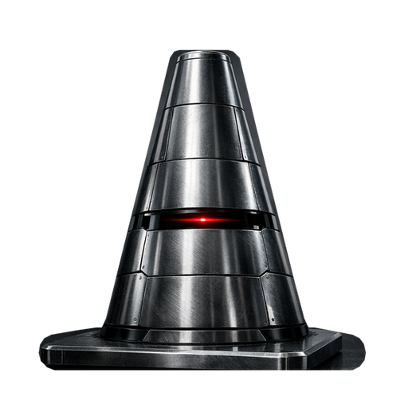

<p align="center">
  
</p>

<h1 align="center">VLC iClean</h1>

<p align="center">
  A privacy-first VLC video filter that buffers, classifies, and masks sensitive frames before presentation.
</p>

<p align="center">
  <a href="https://github.com/asayed18/vlc-iclean/actions/workflows/ci.yml"></a>
  <a href="https://github.com/asayed18/vlc-iclean/actions/workflows/codeql.yml"></a>
  <a href="LICENSE"></a>
  <a href="https://github.com/sponsors/asayed18"></a>
</p>

> [!IMPORTANT]
> VLC iClean is a best-effort content filter, not a guarantee that every
> sensitive frame will be detected. Models can produce false positives and
> false negatives. Test your configuration before relying on it, especially
> for child-safety or accessibility use cases.

VLC iClean targets Windows and Linux today. The macOS build path is present but
has not yet been validated on a macOS runner. Windows remains the most
feature-complete platform because it includes buffered worker inference and a
D3D11 GPU processing backend.

| Platform | Status | Processing path |
| --- | --- | --- |
| Windows x86_64 | Tested | CPU or D3D11; CPU or CUDA inference |
| Linux x86_64 | Tested in WSL/Ubuntu | Portable synchronous CPU path |
| macOS | Build path only | Not yet validated |

## Quick Start

```powershell
cmake -S . -B build-ninja -G Ninja
cmake --build build-ninja --target nsfw_filter nsfw_filter_core -j 8
cmake --build build-ninja --target nsfw_package -j 8
```

Copy the contents of
`releases/v<version>/<os>/plugins/video_filter/` into VLC's
`plugins/video_filter/` directory, regenerate VLC's plugin cache when required,
and enable the filter with `--video-filter=nsfw`.

See [CHANGELOG.md](CHANGELOG.md) for project history and [CONTRIBUTING.md](CONTRIBUTING.md)
for development setup.

The repository also includes:

- a reusable detection core shared library
- multiple built-in ONNX model profiles
- a buffered parallel analysis pipeline for VLC
- scan-ahead tooling that can precompute blocked ranges before playback
- unit tests and integration-style model tests
- per-model benchmarking utilities
- an experimental standalone FFmpeg-based prototype player

## What It Does

At a high level, the project adds an `nsfw` video filter to VLC.

When the filter is active, frames are:

1. buffered before presentation
2. sampled according to an analysis stride
3. converted to RGB and resized for the selected model
4. classified by ONNX Runtime or a heuristic fallback
5. expanded into a block window using configurable padding
6. rendered as black, strong GPU blur, or a warning watermark
7. optionally muted while blocked output is shown

The current implementation is designed so playback should not outrun the detector. The plugin delays output by a configurable frame buffer and lets worker threads analyze queued frames ahead of presentation.

## Main Features

- VLC video filter module with `--video-filter=nsfw`
- ONNX Runtime inference through the `nsfw_filter_core` shared library
- Multiple model profiles:
  - `marqo`
  - `adamcodd`
  - `falconsai`
  - `legacy`
- Automatic fallback to an installed model profile if the selected built-in model file is missing
- CPU and CUDA provider selection
- Parallel worker-thread inference in the VLC plugin on Windows, with a portable CPU fallback path on Linux and macOS
- End-to-end D3D11 processing for hardware-decoded NV12 and P010 frames
- Model-sized GPU downscaling without full-resolution CPU readback
- Automatic frame skipping with configurable stride
- Automatic padding before and after detections
- Buffered playback queue so analysis can happen ahead of displayed frames
- Three block styles:
  - black
  - blur
  - warning watermark
- Optional audio muting while blocked frames are shown, with the previous mute state restored when blocking ends
- On Windows, an embedded VLC iClean icon replaces VLC's active window icon while the filter is loaded and the original icon is restored when the last filter instance closes
- Decision-map playback mode for precomputed blocked time ranges
- Scan-ahead and guard scripts using FFmpeg + VLC RC
- Benchmark executable for Full HD and 4K model timing and basic accuracy checks
- GoogleTest coverage for preprocessing, lifecycle, profile parsing, and ONNX profile integration

## Repository Structure

### Source

- `modules/video_filter/nsfw_filter.c`
  VLC-facing filter module. This is the main plugin implementation.
- `modules/video_filter/nsfw_filter_loader.c`
  Tiny loader shim that forwards VLC entry to `nsfw_filter_impl.dll` when that packaging path is used.
- `src/nsfw_filter_core.cpp`
  Reusable detector core library with model profile handling, preprocessing, ONNX Runtime loading, and inference.
- `src/nsfw_ffplay.cpp`
  Experimental standalone player prototype built on FFmpeg and the same core detector.

### Public Headers

- `include/nsfw_filter.h`
  Internal/shared plugin state definitions for the VLC module.
- `include/nsfw_filter_core.h`
  Public C API for the detector core.

### Tests And Benchmarks

- `tests/nsfw_filter_core_test.cpp`
  Unit tests and integration-style ONNX profile tests.
- `benchmarks/nsfw_filter_benchmark.cpp`
  Per-model benchmark for Full HD and 4K frame classification timing plus simple safe/NSFW fixture accuracy.

### Tools

- `tools/nsfw_scan_ahead.py`
  Pre-scans a video and writes blocked time ranges plus scan status.
- `tools/nsfw_vlc_guard.py`
  Launches the scanner and VLC together, then pauses playback if scan-ahead falls behind.
- `tools/export_falconsai_base_onnx.py`
  Exports the base Falconsai Hugging Face model to ONNX and optionally quantizes it.

### Build / Runtime Working Directories

- `build-ninja/`
  Main CMake/Ninja build output.
- `_scratch_build/`
  Downloaded or generated third-party build assets such as ONNX Runtime, models, and FFmpeg packages.
- `stage/`
  Staged plugin/runtime tree used for testing before copying into VLC.
- `releases/`
  Generated, versioned VLC releases with platform payloads, manifests, checksums, and archives.
- `vlc-portable/`
  Portable VLC tree used for local plugin testing.

### Local Samples

- `sample.mp4`
- `sample_skin.mp4`

These are used to generate test fixtures and to help with quick local validation.

## Architecture

The project is split into two main runtime layers.

### 1. VLC Plugin Layer

Implemented in [modules/video_filter/nsfw_filter.c](modules/video_filter/nsfw_filter.c).

Responsibilities:

- registers the VLC module and configuration UI
- reads VLC config values
- mirrors settings into process environment variables
- loads the core shared library dynamically
- chooses synchronous or worker-thread inference mode
- buffers frames before playback
- converts VLC pictures into model-ready RGB
- applies masking to the output frame
- manages optional audio muting
- supports scan-ahead decision-map playback

### 2. Detection Core Layer

Implemented in [src/nsfw_filter_core.cpp](src/nsfw_filter_core.cpp).

Responsibilities:

- defines model profiles and aliases
- resolves default model file paths
- preprocesses frames into model tensors
- initializes ONNX Runtime dynamically
- selects CPU or CUDA execution provider
- creates and destroys detector instances
- runs inference and returns `nsfw_result_t`

Because the detector core is separate from VLC, it is also used by tests, benchmarks, the scan-ahead tool, and the FFmpeg prototype player.

## Runtime Modes

### Live Detection Mode

This is the standard VLC plugin mode.

Flow:

1. VLC sends decoded pictures to the filter.
2. The filter queues pictures into a ring buffer.
3. Only every Nth frame is analyzed based on `analysis_stride`.
4. Worker threads analyze queued frames in parallel.
5. When a positive hit occurs, the plugin creates a time block window around that timestamp.
6. Any queued or future frames inside that window are masked before presentation.

Important detail:

- The plugin does not need to classify every frame.
- By default it samples every few frames, then expands the blackout window with front/back padding.

### Decision-Map Mode

If `NSFW_DECISION_MAP_PATH` is set, the plugin switches to precomputed blocking mode.

Flow:

1. The scan tool writes blocked ranges such as `blocked <start_ms> <end_ms>`.
2. The plugin periodically reloads that file.
3. Playback frames are blocked based on timestamp membership in those ranges.
4. If the scanner has not yet covered the current timestamp, the plugin conservatively blocks that frame.

This mode is useful when you want scanning to happen outside VLC or ahead of playback.

### Heuristic Fallback Mode

If ONNX Runtime or model loading is unavailable, the plugin can fall back to a lightweight skin-tone heuristic path.

This is primarily a safety fallback and is less accurate than ONNX inference.

## Privacy and Safety

- Live classification runs locally; frames are not uploaded by the plugin.
- Debug frame dumping is disabled unless `NSFW_DEBUG_DUMP_PREFIX` is set.
- Logs and decision maps can reveal local paths or playback timing and should
  be treated as private data.
- Detector or readback failures use conservative fallback behavior where the
  active backend can do so, but model accuracy is never guaranteed.
- Bug reports must use synthetic fixtures and sanitized logs rather than
  explicit or private media.

Report security issues through [private vulnerability reporting](SECURITY.md).

## Supported Models

The built-in profiles currently mapped by the code are:

| Profile | Runtime file | Input size | Upstream/license |
| --- | --- | --- | --- |
| `marqo` | `model.onnx` | `384x384` | [Marqo](https://huggingface.co/Marqo/nsfw-image-detection-384), Apache-2.0 |
| `adamcodd` | `adamcodd.onnx` | `384x384` | [AdamCodd](https://huggingface.co/AdamCodd/vit-base-nsfw-detector), Apache-2.0 |
| `falconsai` | `falconsai.onnx` | `224x224` | [ONNX community export](https://huggingface.co/onnx-community/nsfw_image_detection-ONNX); verify upstream redistribution terms |
| `legacy` | `legacy.onnx` | `299x299` | [iola1999](https://github.com/iola1999/nsfw-detect-onnx), MIT |

Note:

- the UI threshold uses a common `0–1` scale for every visible model
- raw score midpoints are normalized to `0.5`: `0.50` for Marqo, AdamCodd, and Legacy; `0.02` for Falconsai
- the mapping is monotonic, so it preserves each model's score ordering while giving the UI a shared threshold contract

### Model Selection Behavior

- The VLC UI stores the chosen profile as `nsfw-model-profile`.
- At runtime the plugin resolves that to a built-in model file unless `nsfw-model-path` or `NSFW_MODEL_PATH` points to a custom ONNX file.
- If the selected built-in model file is missing from the plugin/runtime directory, the plugin falls back to the first available installed profile.

Current fallback priority in the VLC module:

1. `marqo`
2. `falconsai`
3. `adamcodd`
4. `legacy`

## VLC Configuration UI

### Active Window Icon (Windows)

While the NSFW filter is active, the plugin applies its embedded steel-cone
icon to visible VLC top-level windows. Multiple filter instances are reference
counted, so a filter-chain rebuild cannot restore the stock icon too early. The
original VLC window icon is restored when the final filter instance closes.
This changes the running window, task switcher, and taskbar presentation; it
does not rewrite `vlc.exe` or the user's pinned VLC shortcut.

The plugin registers these user-facing options in VLC:

### Model

- `Model profile`
  Selects the built-in model family.
- `Model path`
  Optional custom ONNX file path.
- `Execution provider`
  `Auto`, `CPU`, or `CUDA`. `Auto` now tries CUDA first and falls back to CPU if the CUDA provider is not available.

### Blocking

- `Blocked frame style`
  `Black out`, `Blur`, or `Warning watermark`.
- `Detection threshold`
  Score threshold from `0.0` to `1.0`.

### Audio

- `Mute audio on blocked frames`
  `0` or `1`. Set to `1` to mute playback while blocked frames are shown and restore the previous mute state when blocking ends.

### Performance

- `Video processing backend`
  `Auto`, `D3D11 GPU`, or `CPU software frames`. `Auto` keeps D3D11-decoded frames on the GPU and falls back to VLC's software conversion path when necessary.
- `Analysis stride`
  Analyze every Nth frame. `0` means automatic.
- `Block padding`
  Number of frames added before and after a detection. `0` means automatic.
- `Buffered frames`
  Number of frames to hold before playback. `0` means automatic.
- `Worker threads`
  Number of ONNX worker threads. `0` means automatic. CUDA-capable installs always use a single worker because each worker owns its own ONNX session.
- `CUDA device id`
  GPU index to use for CUDA execution.

### Paths

- `Decision reload`
  How often the decision-map file is reloaded. `0` means automatic.
- `Decision map path`
  Optional file path for precomputed block ranges.
- `Scan status path`
  Optional file path for scan progress metadata.

### Debug

- `Show evaluation overlay`
  Set to `1` to show the latest evaluated `score/threshold` readout and risk bar in the top-left corner. The color transitions continuously from green through orange to red, reaching red when the score crosses the threshold.

### Internal

- `Settings version`
  Private migration marker used to replace older saved presets with newer defaults.

## Automatic Defaults

The plugin contains several automatic policies when the UI values are left at `0`.

Model score normalization:

- all visible model profiles use the same `0–1` threshold scale
- Marqo, AdamCodd, and Legacy retain their `0.50` raw midpoint; Falconsai's `0.02` raw midpoint maps to the common `0.5` threshold

### Analysis Stride

Current default behavior in [modules/video_filter/nsfw_filter.c](modules/video_filter/nsfw_filter.c):

- most videos: `3`
- `2560x1440` and above: `5`
- `3840x2160` and above: `6`

### Block Padding Frames

Computed as:

- `analysis_stride + 2`

clamped to `32`.

This means the default block window is intentionally larger than the sampling step so nearby missed frames still get masked.

### Buffered Frames

Current automatic defaults:

- small / lower-resolution content: `3`
- `1920x1080` and above: `4`
- `3840x2160` and above: `6`

Then the plugin enforces a minimum required prebuffer based on both:

- padding window size
- analysis parallel window

so the final buffered count may be raised beyond the simple resolution default.

### Decision Reload

- default: every `12` rendered frames

### Worker Threads

- default: number of Windows logical processors, clamped to `8`

## Environment Variables

The VLC module mirrors config values into environment variables and also supports direct environment-based control.

Common variables:

- `NSFW_MODEL_PROFILE`
- `NSFW_MODEL_PATH`
- `NSFW_ONNX_PROVIDER`
- `NSFW_ONNX_CUDA_DEVICE_ID`
- `NSFW_PROCESSING_BACKEND`
- `NSFW_ANALYSIS_STRIDE`
- `NSFW_BLOCK_PADDING_FRAMES`
- `NSFW_BUFFERED_FRAMES`
- `NSFW_WORKER_THREADS`
- `NSFW_DECISION_RELOAD_FRAMES`
- `NSFW_DECISION_MAP_PATH`
- `NSFW_SCAN_STATUS_PATH`

Compatibility / alternative buffer variables:

- `NSFW_BUFFER_MS`
- `NSFW_BUFFER_SECONDS`

Debug variable:

- `NSFW_DEBUG_DUMP_PREFIX`
  Dumps the first blocked output frame as a `.ppm` file for inspection.
- `NSFW_D3D11_PROFILE`
  Enables synchronous D3D11 timestamp queries for benchmarking. Do not enable it during normal playback.

The score overlay is available on both CPU and D3D11 backends. With D3D11
input, a small cached BGRA texture is updated only when the score changes and
composited over the opaque frame on the GPU. It does not force software
conversion or perform a full-frame CPU readback.

The D3D11 backend reads the decoder texture's surface count, reserves three
surfaces for decoding, and retains at most eight opaque pictures. It caps the
effective analysis stride to that queue depth. Larger padding values still
extend the blocked time range without increasing retained decoder frames.

CUDA detection uses one worker even when an older preset requests more. Each
worker owns a separate ONNX CUDA session, so additional workers increase startup
time and GPU memory without helping the normal sampled-analysis workload.

## Blocking Styles

The plugin can modify blocked output in three different ways.

### Black

The frame is replaced with a blackout image appropriate for the frame format.

### Blur

The D3D11 backend downsamples the frame to one thirty-second resolution, applies a two-pass nine-tap Gaussian shader, and bilinearly upscales it. This intentionally makes blocked content barely recognizable while retaining soft transitions. The CPU fallback uses a cheaper block-based pixelation pass.

The implementation contains format-aware pixelation paths to support:

- packed RGB formats
- planar 8-bit YUV
- semi-planar formats
- 16-bit planar formats
- `P010`

### Warning

The original frame remains visible with a compact warning-triangle watermark in the bottom-right corner. This only touches the small watermark area, making it the lowest-cost block style.

## D3D11 Video Backend

On VLC 3.0.21 for Windows, the automatic backend accepts `VLC_CODEC_D3D11_OPAQUE` and `VLC_CODEC_D3D11_OPAQUE_10B` pictures directly. Safe queued pictures remain in their decoder textures. Blocked pictures are rendered through reusable D3D11 resources and copied into VLC's opaque output pool.

Analyzed frames are converted and scaled on the GPU into a model-sized BGRA texture. Only that small texture is staged to system memory for the existing detector. ONNX inference and provider selection are unchanged.

Failure behavior is conservative:

- Initialization failure in `auto` mode asks VLC to rebuild the chain with CPU-accessible pictures.
- Analysis readback failure marks the affected frame as blocked.
- Effect failure falls back to GPU black; if that also fails, the frame is dropped.
- `NSFW_PROCESSING_BACKEND=cpu` forces the existing software path.

The D3D11 path is pinned to VLC `3.0.21`. Other VLC versions, operating systems, and Vulkan use the CPU path.

## Audio Muting

If `Mute audio on blocked frames` is enabled:

- audio is muted as soon as a block window is detected
- the previous mute state is restored when the blocked output window ends

This logic is managed inside the VLC filter, not inside the ONNX detector core.

## Frame Queue And Parallel Processing

The queue logic is one of the most important parts of the project.

The plugin uses:

- a fixed ring buffer of up to `24` queued frames
- per-frame metadata including sequence, timestamp, decision state, and blocked state
- worker threads that classify queued frames in parallel
- output delay so a frame is not displayed until its decision is ready

Important behavior:

- a frame can enter the queue marked as already blocked if it falls inside an existing time block range
- when a new positive detection arrives, the plugin marks queued frames within the new window as blocked
- playback waits until the oldest queued frame is decision-ready

This is how the plugin keeps analysis ahead of visible playback rather than letting unsafe frames slip past first.

## Pixel Format Support

The VLC filter contains explicit handling for a broad set of software pixel formats.

Areas implemented in [modules/video_filter/nsfw_filter.c](modules/video_filter/nsfw_filter.c) include:

- packed RGB packing and scoring
- planar YCbCr packing and scoring
- semi-planar YCbCr packing and scoring
- 16-bit planar variants
- `P010`
- format-specific blackout and blur paths
- direct D3D11 opaque NV12/P010 processing with automatic CPU fallback

## Build System

The project is built with CMake for Windows and Linux. A macOS build path is
present but remains unverified. Windows is the most feature-complete platform
because of the D3D11 backend.

Key options in [CMakeLists.txt](CMakeLists.txt):

- `NSFW_BUILD_TESTS`
- `NSFW_BUILD_BENCHMARKS`
- `NSFW_BUILD_VLC_MODULE`
- `NSFW_DOWNLOAD_MODELS`
  Downloads built-in models during configuration. Disable it for lightweight
  compile-only CI; real-model tests and packaging require the model files.
- `NSFW_INSTALL_VLC_PLUGIN`
- `NSFW_INSTALL_CUDA_RUNTIME`
  Stages CUDA provider DLLs and a matching `onnxruntime.dll` when a CUDA-capable runtime bundle is available.
- `NSFW_RELEASE_ROOT`
  Output root for versioned releases. The default is `releases/` in the repository.
- `NSFW_RELEASE_VERSION`
  Semantic release version. It defaults to the CMake project version (`0.1.0`).
- `NSFW_BUILD_PLAYER_PROTOTYPE`
- `NSFW_EXPORT_FALCONSAI_BASE_ONNX`

### What CMake Downloads Or Prepares

During configuration, CMake may:

- download ONNX Runtime headers
- download ONNX Runtime binaries for Windows and Linux x64, or resolve a shared library from `ONNXRUNTIME_ROOT` or the system library path
- stage a bundled CUDA-capable ONNX Runtime tree from `vlc-portable/plugins/video_filter` or `ONNXRUNTIME_ROOT` when `NSFW_INSTALL_CUDA_RUNTIME` is enabled
- download built-in ONNX model files
- optionally download/export extra Falconsai model variants
- download an FFmpeg Windows package for the prototype, tests, and benchmark fixture generation on Windows
- generate RGB fixture frames from `sample.mp4` and `sample_skin.mp4` on Windows

### Main Targets

- `nsfw_filter_core`
  Shared detector runtime library
- `nsfw_filter`
  VLC plugin module
- `nsfw_ffplay_proto`
  Experimental standalone player
- `nsfw_filter_core_test`
  GoogleTest executable
- `nsfw_filter_benchmark`
  Benchmark executable
- `nsfw_filter_sample_fixtures`
  Generated RGB fixture target
- `nsfw_package`
  Builds and finalizes the current OS release with metadata, checksums, and an archive
- `nsfw_d3d11_runtime_check`
  Portable VLC integration checks for GPU effects, model-sized readback, timing thresholds, and CPU fallback

## Typical Build Workflow

Example Windows/Ninja flow:

```powershell
cmake -S . -B build-ninja -G Ninja
cmake --build build-ninja --target nsfw_filter nsfw_filter_core -j 8
```

To include tests and benchmarks:

```powershell
cmake --build build-ninja --target nsfw_filter_core_test nsfw_filter_benchmark -j 8
```

To run tests:

```powershell
ctest --test-dir build-ninja --output-on-failure
```

To create the files that should be copied into VLC:

```powershell
cmake --build build-ninja --target nsfw_package -j 8
```

The release tree for version `0.1.0` is:

```text
releases/v0.1.0/
|-- windows/
|   |-- plugins/video_filter/
|   |-- release.json
|   `-- SHA256SUMS
|-- linux/
|   |-- plugins/video_filter/
|   |-- release.json
|   `-- SHA256SUMS
|-- mac/NOT_BUILT.txt
|-- release-index.json
|-- vlc-iclean-v0.1.0-windows-x86_64-cpu.zip
|-- vlc-iclean-v0.1.0-windows-x86_64-cpu.zip.sha256
|-- vlc-iclean-v0.1.0-linux-x86_64-cpu.tar.gz
`-- vlc-iclean-v0.1.0-linux-x86_64-cpu.tar.gz.sha256
```

Each build cleans and refreshes only its current OS folder and matching archive.
Build the target on Windows, Linux, and macOS to populate all three releases.
A platform marked `not-built` must not be published. Unbuilt platforms contain
only `NOT_BUILT.txt`, and
`release-index.json` records each platform as `built` or `not-built`. Tests,
benchmarks, headers, samples, and intermediate files are not copied. Set
`NSFW_INSTALL_CUDA_RUNTIME=OFF` for a smaller Windows CPU-only release.

To prepare a different version, reconfigure with a semantic version before
building the package target:

```powershell
cmake -S . -B build-ninja "-DNSFW_RELEASE_VERSION=0.2.0"
cmake --build build-ninja --target nsfw_package -j 8
```

Linux x64 builds download the matching runtime automatically when no system
copy is found. If Linux or macOS configuration still cannot find ONNX Runtime,
packaging prints a warning and omits it. Set `ONNXRUNTIME_ROOT` to a matching
runtime installation and reconfigure before shipping that package; otherwise
detection uses the heuristic fallback.

To run the portable D3D11 integration checks:

```powershell
cmake --build build-ninja --target nsfw_d3d11_runtime_check -j 8
```

## Installing Into VLC

Copy the contents of the matching
`releases/v<version>/<os>/plugins/video_filter/` folder into VLC's
`plugins/video_filter` directory. The project supports two common testing
layouts.

### Portable VLC

Copy runtime files into the portable VLC plugin directory, usually:

- `vlc-portable\plugins\video_filter\`

### Installed VLC

Copy runtime files into:

- `C:\Program Files\VideoLAN\VLC\plugins\video_filter\`

Required runtime files typically include:

- `libnsfw_filter_plugin.dll`
- `nsfw_filter_core.dll`
- `onnxruntime.dll`
- `onnxruntime_providers_shared.dll`
- built-in model `.onnx` files you want available
- MinGW runtime DLLs when applicable:
  - `libstdc++-6.dll`
  - `libgcc_s_seh-1.dll`
  - `libwinpthread-1.dll`

### Linux And macOS

Copy the shared libraries and models into VLC's plugin directory for your distro or app bundle. Typical file names are:

- `libnsfw_filter_plugin.so` or `libnsfw_filter_plugin.dylib`
- `libnsfw_filter_core.so` or `libnsfw_filter_core.dylib`
- `libonnxruntime.so` or `libonnxruntime.dylib`
- the built-in `.onnx` model files you want available

The plugin resolves sibling model and runtime files from its own directory first, so side-by-side installs are the most reliable layout.

After replacing plugin binaries in an installed VLC tree, regenerate the plugin cache:

```powershell
"C:\Program Files\VideoLAN\VLC\vlc-cache-gen.exe" "C:\Program Files\VideoLAN\VLC\plugins"
```

## Tests

The test suite in [tests/nsfw_filter_core_test.cpp](tests/nsfw_filter_core_test.cpp) covers:

- sensitivity threshold mapping
- preprocessing correctness
- RGB vs RGBA handling
- invalid input rejection
- detector lifecycle with injected fake backends
- classification threshold behavior
- default config values
- model profile parsing and aliases
- real detector smoke tests
- integration tests for each ONNX profile
- sample fixture classification for each ONNX profile

The tests are designed so they can still run partially even if a real model cannot be created in the current environment; those cases are skipped rather than treated as hard failures.

## Benchmarks

The benchmark executable in [benchmarks/nsfw_filter_benchmark.cpp](benchmarks/nsfw_filter_benchmark.cpp) reports:

- model name
- resolution (`fullhd`, `4k`)
- average safe-frame classification time
- average NSFW-frame classification time
- combined average time
- simple 2-sample accuracy percentage
- output scores for the safe and NSFW fixtures

Output format is CSV:

```text
model,resolution,safe_ms,nsfw_ms,avg_ms,accuracy_pct,safe_score,nsfw_score
```

## Scan-Ahead Tooling

### `tools/nsfw_scan_ahead.py`

  This script:

- uses FFmpeg to decode and sample video frames
- scales them to the detector input size
- classifies them through the `nsfw_filter_core` shared library
- writes a decision map file
- writes a scan status file

Useful options:

- `--input`
- `--output`
- `--status`
- `--core-dll`
- `--model-path`
- `--provider`
- `--threshold`
- `--sample-fps`
- `--hold-seconds`
- `--write-every`

### `tools/nsfw_vlc_guard.py`

This wrapper:

- launches `nsfw_scan_ahead.py`
- waits for an initial ahead-of-time buffer
- launches VLC with the NSFW filter enabled
- connects to VLC RC
- pauses playback if the scan-ahead lead drops below the target buffer
- resumes when enough future content has been scanned

This is the project’s more conservative playback-control path when you want scanning outside the VLC filter itself.

## Experimental Prototype Player

The FFmpeg prototype in [src/nsfw_ffplay.cpp](src/nsfw_ffplay.cpp):

- decodes frames with FFmpeg
- uses the same detector core
- supports CPU/CUDA provider choice
- supports the same model profiles
- supports black, blur, and warning block styles
- buffers playback before starting
- auto-pauses when decode/analyze buffering is too low

It is useful for debugging detector behavior outside VLC’s module and filter chain complexity.

## Configuration Persistence And Migration

The plugin contains migration logic for older saved presets.

If it detects a known old preset combination, it replaces it with current defaults and writes the updated config back through VLC’s config accessors.

Current modern defaults are effectively:

- `marqo`
- `cpu`
- `black`
- threshold `0.5`
- mute disabled
- automatic stride / padding / buffer / worker count / decision reload

## Known Design Constraints

- The parallel worker queue is still Windows-specific in the VLC plugin; Linux and macOS currently use the portable synchronous detector path.
- Hardware-decoded opaque video formats are rejected so VLC can convert to software-compatible formats first.
- CUDA usage depends on the correct ONNX Runtime CUDA provider DLLs being present beside the plugin runtime.
- Local development setups can provide a portable VLC tree with a CUDA-capable ONNX Runtime bundle for runtime testing.
- The `falconsai-official` profile is optional and will not work unless `quantized_model.onnx` is actually installed.
- Heuristic fallback exists, but it is not equivalent to real model inference.

## File-Level Guide

If you want to jump into the code quickly:

- Start with [modules/video_filter/nsfw_filter.c](modules/video_filter/nsfw_filter.c) for plugin behavior, buffering, masking, and VLC integration.
- Read [src/nsfw_filter_core.cpp](src/nsfw_filter_core.cpp) for model profiles, preprocessing, ONNX loading, and provider logic.
- Use [include/nsfw_filter_core.h](include/nsfw_filter_core.h) to understand the public detector API.
- Use [CMakeLists.txt](CMakeLists.txt) to understand download, export, staging, install, and optional target behavior.
- Use [tools/nsfw_scan_ahead.py](tools/nsfw_scan_ahead.py) and [tools/nsfw_vlc_guard.py](tools/nsfw_vlc_guard.py) for pre-scan workflows.

## Community

- Read [CONTRIBUTING.md](CONTRIBUTING.md) before proposing changes.
- Use [GitHub Discussions](https://github.com/asayed18/vlc-iclean/discussions) for support.
- Follow the [Code of Conduct](CODE_OF_CONDUCT.md).
- Report vulnerabilities privately as described in [SECURITY.md](SECURITY.md).

## Sponsorship

If VLC iClean is useful to you, you can support its development through
[GitHub Sponsors](https://github.com/sponsors/asayed18).

## License and Trademarks

VLC iClean is distributed under [GPL-2.0-or-later](LICENSE). Individual files
may retain compatible file-level notices. See [NOTICE.md](NOTICE.md) and
[THIRD_PARTY_NOTICES.md](THIRD_PARTY_NOTICES.md).

VLC and VLC media player are trademarks of VideoLAN. VLC iClean is an
independent project and is not affiliated with or endorsed by VideoLAN.
